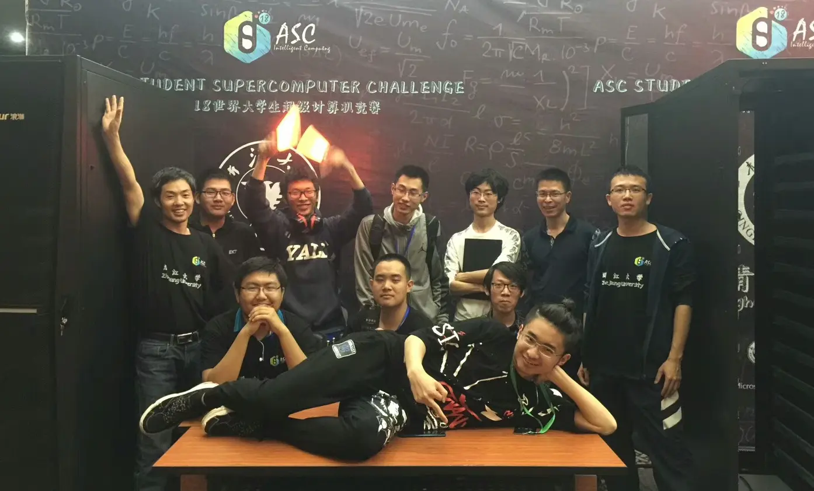
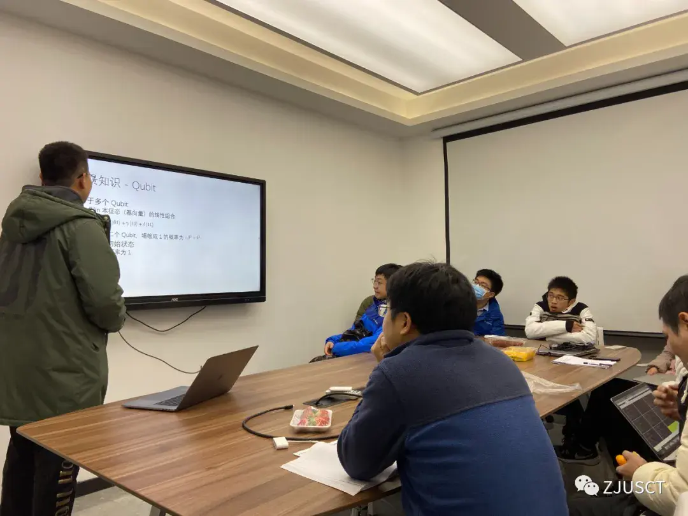
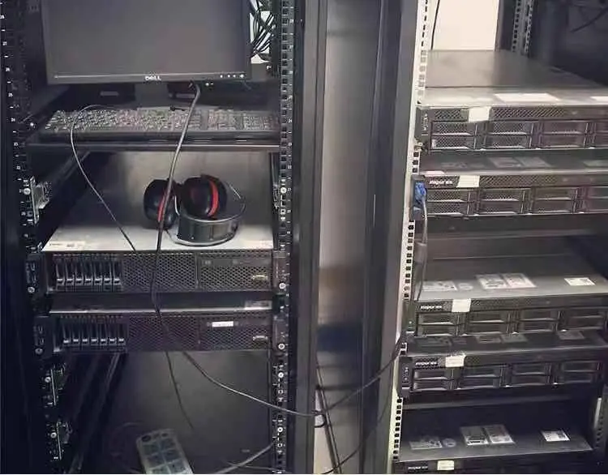

# ZJUSCT 历史

!!! abstract

    收集超算队发展的历史资料，记录超算队的成长历程。

## 竞赛历程

| 年份和赛事 | 照片 |
| --- | --- |
| 2017 ASC |  |
| 2021 ASC |  |

## 自建集群发展历史

### 远古时期

浪潮 M3、M4 服务器组成的集群。

## 赞助与合作

- ASC2016 获英伟达硬件 Tesla GPU K80 加速卡硬件赞助
- ASC2018 获 AMAX 赞助借用硬件 Tesla GPU V100 8 块
